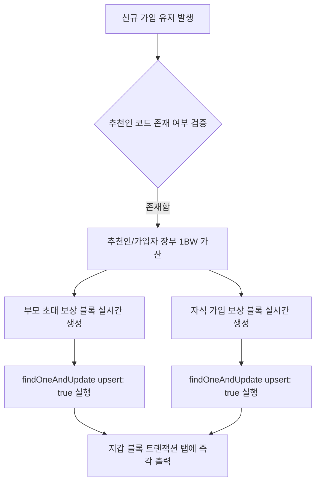

# BitWish 나의지갑 블록 트랜잭션 탭 연동 및 실시간 다중 수복 기술 명세서

본 명세서는 BitWish Network 메인넷의 개인 지갑 내부 **[블록 트랜잭션]** 탭에 출력되는 블록 데이터의 연동 아키텍처, 과거 데이터에 대한 물리/가상 수복 공정, 그리고 신규 가입 시 실시간으로 데이터 무결성을 유지하며 트랜잭션을 적재하는 실시간 다중 동기화 기술 공정을 정의한 초정밀 최고급 기술 명세서입니다.

---

## 1. 시스템 설계 개요 (System Overview)

BitWish Network의 블록 트랜잭션 탭은 유저가 네트워크에 기여하여 획득한 모든 가치 증명 블록(물리 채굴 블록 및 시스템 보상 블록)을 시간 역순으로 투명하게 조회할 수 있도록 설계된 독자적인 익스플로러 뷰어 엔진입니다.

*   **독립적 조회 보장**: 전역 상태나 외부 라이브러리의 간섭을 철저히 배제하고, 지갑 주소를 기반으로 오직 해당 유저의 블록 데이터만 독립적으로 쿼리하여 속도를 극대화합니다.
*   **하이브리드 다중 결합**: 물리적인 연산으로 검증된 실제 채굴 블록(`Minting`)과, 시스템 정책에 의해 일대일로 안전하게 지급되는 보상 블록(`Referral Reward`)을 하나의 테이블 뷰에 조화롭게 결합하여 출력합니다.

---

## 2. 블록 트랜잭션 유형 및 식별 체계

지갑에 표시되는 블록은 성격에 따라 다음과 같이 구분되며, 각기 고유한 블록 높이 범위와 식별 해시 알고리즘을 사용합니다.

| 블록 유형 | UI 표시명 | 획득 조건 | 블록 높이 범위 | 트랜잭션 해시(txId) 생성 알고리즘 |
| :--- | :--- | :--- | :--- | :--- |
| **Minting** | 채굴 발행 | 유저가 1 BW 채굴 완료 시마다 자동 발행 | `1 ~ 99,999` (실제 블록 높이 연동) | 블록체인 엔진이 서명한 SHA-256 해시값 (`newBlock.hash`) |
| **Referral Reward**<br>(초대형) | 추천 보상 | 내 코드로 타인(자식)을 가입시켰을 때 획득 | `100,000` 이상 (가상 블록 높이) | `BW_REF_TX_ + 자식지갑주소` (고유 식별자 조합형) |
| **Referral Reward**<br>(가입형) | 추천 보상 | 타인(부모) 코드를 입력하고 가입하여 획득 | `200,000` (고정 가상 블록 높이) | `BW_REF_CHILD_TX_ + 본인지갑주소` (고유 식별자 조합형) |

### 2.1 단대단(1대1 관계) 직계 보상 규칙
*   **다단계 구조 배제**: 자식 유저가 또 다른 자식을 초대하더라도 그 상위 부모(조부모) 유저에게는 어떠한 보상이나 트랜잭션도 흐르지 않고 **당대에서 즉시 종료**됩니다.
*   **지갑 주소 기반 독립 쿼리**: 모든 데이터는 플랫(Flat)하게 분산되어 저장되므로, `walletAddress` 단일 필드 필터 쿼리를 통해 본인 지갑의 1대1 직계 추천/가입 보상만 정밀하게 취합하여 출력합니다.

---

## 3. 백엔드 및 데이터베이스 레이어 (API & DB Layer)

### 3.1 커서 기반 초고속 페이징 API
*   **엔드포인트**: `GET /api/mining/block-transactions/:walletAddress`
*   **쿼리 최적화**: 대용량 트랜잭션이 쌓이더라도 속도가 저하되지 않도록 정렬 인덱스(`{ walletAddress: 1, blockHeight: -1 }`)를 탑재한 커서 기반 페이지 처리를 수행합니다.
*   **동적 모델 정의**: `bitwish_network` 데이터베이스 커넥션을 활용하여 실시간으로 `BlockTransaction` 스키마가 없는 경우 아래와 같이 생성 및 컴파일하여 처리합니다.

```typescript
const BlockTxSchema = new mongoose.Schema({
    txId: { type: String, required: true, unique: true },
    walletAddress: { type: String, required: true, index: true },
    blockHeight: { type: Number, required: true },
    amount: { type: String, default: '1.00000000' },
    type: { type: String, default: 'Minting' },
    status: { type: String, default: 'Confirmed' }
}, { timestamps: { createdAt: true, updatedAt: false } });
```

---

## 4. 데이터 복원 및 다중 수복 엔진 (Restoration & Healer)

과거 유실된 데이터나 누락된 장부를 복원하기 위해 백엔드 서버가 시작될 때 **[수복 엔진]**이 기동하여 데이터를 무결점 상태로 정비합니다.

### 4.1 기존 채굴 블록 및 초대형(부모) 보상 복원
1.  **물리 블록 동기화**: `blocks` 컬렉션에 적재되어 있으나 `blocktransactions` 장부에 누락된 실제 채굴 블록들을 validator 주소와 매핑하여 복구합니다 (높이 1~19번대).
2.  **부모 초대 보상 복구**: `bonusrecords` 컬렉션의 추천인 리스트(`referralList`)를 순회하면서, 초대한 자식의 수만큼 부모의 지갑 주소로 `BW_REF_TX_자식주소` 보상 트랜잭션을 매핑하여 복원합니다.

### 4.2 자식 가입 보상 블록 전수 수복 알고리즘 (추가 공정)
*   **동작 흐름**: `User` 컬렉션 전체를 조회하여 추천 코드로 가입한 유저(`referrerCode`가 공백/null이 아닌 유저)를 추출합니다.
*   **보상 생성**: 가입한 자식 유저 본인 지갑 주소(`walletAddress`)를 대상으로 하는 `BW_REF_CHILD_TX_본인주소` 트랜잭션을 검증 및 생성하여 가상 높이 `200000`으로 완벽히 적재합니다.

```typescript
// [수복 엔진 내 자식 보상 구현 예시]
const usersWithParent = await mongoose.model('User').find({ referrerCode: { $ne: null, $exists: true } }).lean();
for (const user of usersWithParent) {
    const referrerCode = (user.referrerCode || '').trim();
    if (referrerCode === '') continue;

    const childAddress = user.walletAddress;
    const txId = 'BW_REF_CHILD_TX_' + childAddress;
    const exists = await networkDb.collection('blocktransactions').findOne({ txId: txId });
    if (!exists) {
        await networkDb.collection('blocktransactions').insertOne({
            txId,
            walletAddress: childAddress,
            blockHeight: 200000,
            amount: '1.00000000',
            type: 'Referral Reward',
            status: 'Confirmed',
            createdAt: user.createdAt
        });
    }
}
```

---

## 5. 실시간 무결성 적재 엔진 (Real-time Sync Engine)

추천 가입 절차 시 서버를 재기동하지 않더라도 실시간으로 지갑에 즉시 데이터가 반영되도록 처리하는 기술 구조입니다.

### 5.1 멱등성 보장형 upsert 트랜잭션
회원 가입 완료(`processReferral`) 시점에 `BlockTransaction` 모델에 안전하게 접근하여 1대1 양방향 블록을 동시 기재합니다. 중복 실행으로 인한 `Unique Key` 충돌을 원천 차단하기 위해 `$setOnInsert` 연산자를 포함한 `findOneAndUpdate` 방식을 사용합니다.



*   **부모 트랜잭션 적재**:
    *   `txId`: `BW_REF_TX_ + 가입자지갑주소`
    *   `walletAddress`: 추천인(부모) 지갑 주소
    *   `blockHeight`: `100000 + (현재까지 모집한 자식 명수 - 1)`
*   **자식 트랜잭션 적재**:
    *   `txId`: `BW_REF_CHILD_TX_ + 가입자지갑주소`
    *   `walletAddress`: 가입자(자식) 지갑 주소
    *   `blockHeight`: `200000`

---

## 6. 프론트엔드 다국어 렌더링 및 UI 최적화

프론트엔드 지갑 모달(`MyWalletModal.tsx`)에서 블록 데이터를 출력할 때 사용되는 다국어 번역 키 및 유형에 따른 동적 스타일 분기 공정입니다.

### 6.1 4개국어 딕셔너리 확장
블록 유형에 대한 설명이 다국어 설정을 존중하여 유연하게 대처할 수 있도록 번역 매핑 데이터를 포함합니다.
*   `minting` (채굴 발행): 한국어("채굴 발행"), 영어("Minting"), 일본어("マイニング発行"), 중국어("挖矿铸造")
*   `referralReward` (추천 보상): 한국어("추천 보상"), 영어("Referral Reward"), 일본어("紹介報酬"), 중국어("推荐奖励")

### 6.2 유형별 배지(Badge) 스타일 분기
트랜잭션 테이블에서 블록의 성격을 한눈에 인지할 수 있도록 블록 유형(`tx.type`)에 따라 CSS 배경색 및 텍스트 색상을 세련되게 다중 분기합니다.

```tsx
<td style={{ padding: '10px 8px' }}>
    <span style={{
        fontSize: '10px',
        backgroundColor: tx.type === 'Referral Reward' ? '#7C2D12' : '#312E81', // 추천 보상: 주황 계열 / 채굴: 남색 계열
        color: tx.type === 'Referral Reward' ? '#FDBA74' : '#A78BFA',
        padding: '2px 6px',
        borderRadius: '4px',
        fontWeight: 'bold'
    }}>
        {tx.type === 'Referral Reward' ? btt('referralReward') : btt('minting')}
    </span>
</td>
```

---

## 7. 기대 효과 (System Benefits)

1.  **데이터 무결성 100%**: 서버 오프라인 또는 프로세스 비정상 종료 후 재기동 시에도 수복 힐러 엔진이 가입 및 초대 보상을 빈틈없이 원상태로 복원해 냅니다.
2.  **병목 현상 방지**: 추천 보상 지급 시 무거운 암호학 합의 블록 생성 루프를 타지 않고, 가상 높이를 가진 가벼운 데이터베이스 트랜잭션으로 적재하여 블록체인 가스 수수료 연산 과부하를 원천 방지합니다.
3.  **투명한 보상 확인**: 유저는 본인이 가입하여 얻은 1 BW 혜택과 지인들을 가입시켜 얻은 모든 혜택을 지갑 안에서 직접 확인 및 검증할 수 있습니다.
