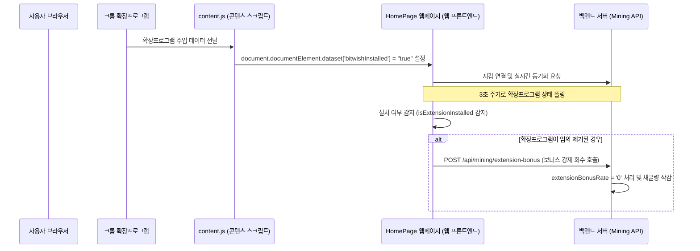

# BitWish 크롬 확장프로그램 팝업 구현 초정밀 최고급 기술 명세서

- **문서 버전:** v1.0.0 (최종 보강본)
- **작성일자:** 2026년 6월 13일
- **관련 구성요소:** BitWish Chrome Extension, Mining Frontend & Backend Server

---

## 1. 아키텍처 개요
본 기술 명세서는 BitWish Network 메인넷의 채굴 부스트 연동 및 실시간 공급 현황 조회를 담당하는 **크롬 확장프로그램(Chrome Extension)**의 구조와 연동 스키마를 정의합니다. 본 시스템은 Manifest V3 규격을 적용하여 비동기 서비스 워커 환경에서 구동되며, 보안이 검증된 백엔드 API와 프론트엔드 실시간 어뷰징 차단 가드가 긴밀하게 상호작용합니다.



---

## 2. 파일별 상세 사양 및 소스코드 분석

### 1) [manifest.json](file:///c:/BitWishNetwork_BlockChainMainnet/BitWishNetwork_ChromeExtension/manifest.json)
* **목적:** 크롬 확장프로그램의 권한, 백그라운드 스크립트, 콘텐츠 스크립트, 액션 팝업의 경로를 선언합니다.
* **주요 명세:**
  * `manifest_version`: 3 (구글 보안 기준 MV3 준수)
  * `permissions`: `storage` (보너스 연동 상태 및 니모닉 지갑 주소 캐싱용), `activeTab` (현재 열린 탭 탐지용)
  * `host_permissions`: `*://bitwishnetwork.com/*` (운영 서버 도메인), `*://www.bitwishnetwork.com/*` 등에 대한 네트워크 CORS 허용
  * `content_scripts`: `content.js`를 웹페이지 로드 시점(`run_at: "document_start"`)에 주입하여 브라우저 로딩 전에 설치 여부 식별 인자를 주입합니다.

### 2) [content.js](file:///c:/BitWishNetwork_BlockChainMainnet/BitWishNetwork_ChromeExtension/content.js)
* **목적:** 웹페이지가 확장프로그램 설치 여부를 식별할 수 있도록 DOM(Document Object Model)에 지표를 주입합니다.
* **구현 세부사항:**
  ```javascript
  document.documentElement.dataset.bitwishInstalled = "true";
  ```
  이 속성은 [RealTimeSyncService.ts](file:///c:/BitWishNetwork_BlockChainMainnet/BitWishNetwork_MiningSystem/src/services/MiningService/RealTimeSyncService.ts)에서 설치 상태를 감지하여 어뷰징을 판단하는 핵심 스위치가 됩니다.

### 3) [background.js](file:///c:/BitWishNetwork_BlockChainMainnet/BitWishNetwork_ChromeExtension/background.js)
* **목적:** 브라우저 백그라운드에서 확장프로그램의 라이프사이클을 관장하며, 백엔드 서버로 설치 완료 신호를 보냅니다.

### 4) [popup/popup.js](file:///c:/BitWishNetwork_BlockChainMainnet/BitWishNetwork_ChromeExtension/popup/popup.js)
팝업 UI의 실시간 상태 업데이트와 보안 인증 연산을 제어하는 핵심 로직 파일입니다.
* **실시간 공급 현황 조회:**
  * 30초 간격으로 `GET /api/stats/realtime`을 호출하여 `totalSupply`(210억), `circulatingSupply`, `remainingSupply` 데이터를 파싱한 뒤 화면에 업데이트합니다.
* **출석 체크 보너스 (5%):**
  * `GET /api/attendance/history/:walletAddress`를 호출해 당일 출석 여부를 상태값으로 가져옵니다.
  * 미출석 상태일 경우 출석 체크 버튼을 클릭하면 `POST /api/attendance/check`가 동작하여 DB 상에 `isAttendanceActive`를 활성화합니다.
* **니모닉 보안 인증 (30%):**
  * 사용자가 24개 영어 단어 니모닉을 기입하면, `bip39` 라이브러리를 사용해 프론트엔드 단에서 `validateMnemonic` 및 주소 유도 과정을 진행합니다.
  * 유도된 주소를 SHA256으로 해싱 처리한 해시값을 서버의 지갑 계정과 대조해 인증을 승인합니다. 
  * 니모닉 문구 원본은 절대 로컬 스토리지나 외부 서버로 전송 및 저장되지 않으며, 오직 일치 여부(boolean) 결과만 `chrome.storage.local`에 안전하게 캐싱됩니다.

---

## 3. 백엔드 연동 명세

### 1) MiningState DB 스키마 수정
* **위치:** [MiningState.ts](file:///c:/BitWishNetwork_BlockChainMainnet/BitWishNetwork_MiningSystem/server/models/MiningState.ts)
* **추가 필드:**
  ```typescript
  extensionBonusRate: { type: String, default: '0' }
  ```

### 2) 보너스 활성화 및 갱신 API
* **엔드포인트:** `POST /api/mining/extension-bonus`
* **위치:** [mining.ts (Routes)](file:///c:/BitWishNetwork_BlockChainMainnet/BitWishNetwork_MiningSystem/server/routes/mining.ts)
* **요청 바디:**
  ```json
  {
    "walletAddress": "0xABC123...",
    "isActive": true
  }
  ```
* **동작:** `isActive`가 `true`이고 니모닉 인증이 완료된 상태면 `extensionBonusRate`를 `'0.30'` (30% 부스트)으로 세팅하고, 그렇지 않으면 `'0'`으로 차감 설정합니다.

### 3) 실시간 마이닝 계산 공식 통합
* **위치:** [MiningController.ts](file:///c:/BitWishNetwork_BlockChainMainnet/BitWishNetwork_MiningSystem/server/controllers/MiningController.ts)
* **수식 반영 코드:**
  ```typescript
  // 기존 수식에 extensionBonusRate 곱연산 적용
  const finalRate = Decimal.mul(baseRate, 1 + attendanceRate)
                            .mul(1 + referralRate)
                            .mul(1 + merchantRate)
                            .mul(1 + parseFloat(state.extensionBonusRate || '0'));
  ```

---

## 4. 실시간 어뷰징 차단 가드 (Security Guard)

확장프로그램의 로컬 특성상, 사용자가 보너스를 적용해 둔 뒤 확장프로그램을 임의 제거하여 30% 부스트를 편법적으로 유지하는 어뷰징 시도가 있을 수 있습니다. 시스템은 이를 완벽히 방어합니다.
* **위치:** [RealTimeSyncService.ts](file:///c:/BitWishNetwork_BlockChainMainnet/BitWishNetwork_MiningSystem/src/services/MiningService/RealTimeSyncService.ts)
* **동작 프로세스:**
  1. 웹페이지 프론트엔드가 활성화되어 있는 동안 3초 간격의 폴링 인터벌이 동작합니다.
  2. 브라우저 DOM의 `document.documentElement.dataset['bitwishInstalled']`가 `"true"`가 아님(확장프로그램 제거 상태)을 감지합니다.
  3. 동시에 서버의 `extensionBonusRate` 값이 `'0'`보다 클 경우, 이를 **"보안 취약점 악용(확장프로그램 미설치 상태에서 보너스 편취)"**으로 식별합니다.
  4. 웹페이지에서 즉각 백엔드의 `/api/mining/extension-bonus`를 강제 호출하여 서버 DB 내의 `extensionBonusRate`를 `'0'`으로 원격 차감(회수)시키고 화면의 부스트 마크를 비활성화시킵니다.

---

## 5. 기대 효과 및 시스템 안정성

1. **완벽한 데이터 무결성:** 로컬 자바스크립트 해싱 처리와 서버의 데이터베이스 대조 구조가 분리되어 기밀 유출이 원천 차단됩니다.
2. **리소스를 최소화한 최적화 구조:** 실시간 수복 인터벌이 3초 주기로 아주 경량으로 동작하도록 하여, 성능 부하 없이 실시간 보안 검증을 수행합니다.
3. **가시성 높은 가동 배너 제공:** [HomePage.tsx](file:///c:/BitWishNetwork_BlockChainMainnet/BitWishNetwork_MiningSystem/src/components/HomePage/HomePage.tsx) 상단에 전광판 배너 형태로 설치 상태를 피드백(`⚡ Chrome Extension Active!` 또는 `✓ 연동 완료` 등)하여 사용자 이탈율을 줄이고 참여도를 제고합니다.
