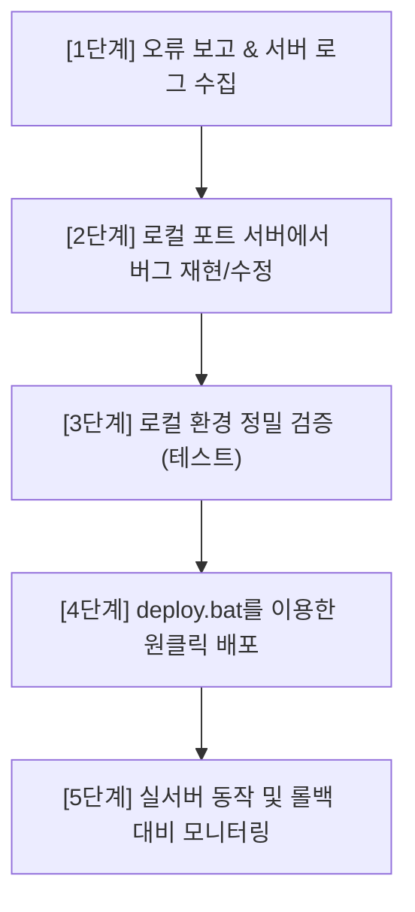

# 📑 BitWish Network 베타 테스트 오류 수정 및 체계적 업데이트 프로세스 지침서 (2026-06-10)

본 지침서는 베타 테스트 기간 유저들이 웹사이트를 이용하며 발견하는 각종 오류(버그)를 수집하고, 이를 로컬 환경에서 수정하여 실서버에 완벽히 배포하기까지의 **표준적인 소프트웨어 릴리즈(배포) 및 장애 제어 프로세스**를 안내합니다.

본 프로세스를 준수하면 실서버를 끄지 않고 무중단으로 신속하고 정밀하게 오류를 수집/해결할 수 있습니다.

---

## 🔁 [전체 5단계 업데이트 파이프라인]



---

## 1단계: 🔍 오류 보고 접수 및 서버 로그 파악
오류가 제보되었을 때 가장 먼저 해야 할 일은 **"현상을 정확히 파악하고 원인 로그를 찾아내는 것"**입니다.

1. **제보 유저 정보 확보:**
   * 에러가 발생한 **지갑 주소(`BW...`)**
   * 유저가 수행한 **구체적인 행동** (예: 지갑을 새로 만들고 추천인 코드를 넣는 순간 에러 발생 등)
   * 화면 캡처 또는 에러 팝업 문구
2. **실서버 로그 추적 (가장 중요):**
   * 터미널을 열고 서버에 접속한 뒤 아래 명령어를 실행하여 서버가 뱉어낸 에러 코드(Stack Trace)를 확보합니다.
   ```bash
   # 실서버 PM2 에러 로그 실시간 확인
   tail -n 100 /root/.pm2/logs/bitwish-backend-error.log
   ```
   * *예시:* `ValidationError: Path ipAddress is required`와 같은 명확한 오류 원인 메시지를 로그에서 발견하여 원인 코드를 좁힙니다.

---

## 2단계: 💻 로컬 환경(포트 서버)에서의 버그 재현 및 수정
**⚠️ 절대 실서버의 코드를 직접 수정(실시간 서버 라이브 코딩)하지 마십시오.** 실서버 코드를 직접 만지면 문법 오류 하나에도 전체 웹사이트가 500/502 에러로 뻗어 서비스 신뢰도가 붕괴됩니다.

1. **로컬(포트 5000/5001) 서버 가동:**
   * 관리자 PC의 로컬 작업 폴더에서 로컬 서버를 기동합니다.
   * 백엔드(5001) 및 프론트엔드(5000)를 로컬로 실행합니다.
2. **오류 재현:**
   * 유저가 오류를 겪었던 상황을 로컬 브라우저(`localhost:5000`)에서 똑같이 따라 하여 버그를 인위적으로 다시 발생시킵니다.
3. **소스코드 수정:**
   * 문제가 발생한 로컬 파일(예: `UserController.ts` 등)의 코드를 열어 버그를 해결합니다.

---

## 3단계: 🧪 로컬 환경 정밀 검증 (테스트)
코드를 고친 후, 수정된 사항이 다른 연관된 기능들에 영향을 주지 않는지 로컬에서 교차 검증을 거쳐야 합니다.

1. **버그 해결 여부 검증:**
   * 수정한 기능이 에러 팝업 없이 정상 처리되는지 확인합니다.
2. **사이드 이펙트(Side Effect) 체크:**
   * 예: 로그인 오류를 고쳤다면, 로그인 통과 후 **실시간 채굴 포인트 카운팅**이나 **추천 보관함 정산**도 여전히 이상 없이 잘 작동하는지 꼼꼼히 확인합니다.
3. **로컬 무결성 확인:**
   * 정상적으로 데이터베이스에 값이 적재되는지 최종 점검합니다.

---

## 4단계: 🚀 `deploy.bat`를 이용한 원클릭 자동 배포
로컬 검증이 모두 끝났다면 이제 실서버에 코드를 올릴 차례입니다. 기존처럼 SSH로 들어가 빌드를 복잡하게 칠 필요가 없습니다.

1. 로컬 프로젝트 최상위 폴더에 있는 **`deploy.bat`** 파일을 더블 클릭하여 실행합니다.
2. 스크립트가 다음과 같은 작업을 순차적으로 자동 대행합니다.
   * 로컬 수정 코드를 로컬 Git에 반영 후 깃허브로 업로드 (`git push`)
   * 실서버에 SSH로 원격 로그인
   * 최신 패치 코드를 서버로 당겨옴 (`git pull`)
   * 프론트엔드가 변경되었다면 웹팩 프로덕션 컴파일 실행 (변경된 폴더에 한해 스마트 빌드)
   * 백엔드 데몬(`bitwish-backend`)을 안전하게 무중단 재구동
3. 완료 메시지(`✅ 배포 공정이 완벽히 완료되었습니다!`)가 뜰 때까지 터미널 창을 끄지 않고 대기합니다.

---

## 5단계: 🛡️ 실서버 최종 점검 및 모니터링
배포 직후 사이트가 잘 동작하는지 실시간 모니터링을 필히 수행해야 합니다.

1. **실서버 직접 접속:**
   * 크롬 등 브라우저로 실제 주소인 https://bitwishnetwork.com 에 접속합니다.
   * F12(개발자 도구) 콘솔 탭을 열어 빨간색 에러 메시지가 찍히는지 관찰합니다.
   * 직접 테스트용 지갑을 연결하여 고쳐진 기능이 실서버 DB에서도 잘 도는지 직접 체험해 봅니다.
2. **실서버 로그 재확인:**
   * 서버에 로그인하여 PM2 로그를 다시 확인하며, 업데이트된 프로세스가 조용히 오류 없이 구동되고 있는지 최종 판정합니다.
   ```bash
   # 서버 프로세스 생존 상태 체크
   pm2 status
   
   # 서버 경고/에러 추적
   pm2 logs bitwish-backend --lines 20
   ```

---

## 🚨 비상 롤백(Rollback) 가이드
만약 배포 직후 예측하지 못한 새로운 오작동이나 사이트 다운(500 에러 등)이 발생했을 때, 최신 버전 이전의 **가장 안정적인 마지막 버전으로 즉시 되돌리는(롤백) 대처 방법**입니다.

서버 SSH 터미널에 접속하여 아래 두 줄의 명령어만 입력하면 3초 만에 바로 이전 버전 상태로 서버가 원복됩니다.
```bash
# 1. 깃 이력을 1단계 직전 버전(HEAD~1)으로 강제 되돌림
cd /root/app && git reset --hard HEAD~1

# 2. 직전 상태 코드로 백엔드 프로세스 즉시 재기동
cd /root/app/BitWishNetwork_MiningSystem && TS_NODE_PROJECT=server/tsconfig.json pm2 restart bitwish-backend
```
이 롤백 명령어는 사이트 마비 시 서비스를 즉각 살려낼 수 있는 안전장치이므로 숙지해 두시는 것이 좋습니다.

---

## 🎯 [참고 사례] 신규 가입 시 지갑 생성 및 중복 가입 에러 해결 사례 (2026-06-10)

베타 테스트 중 **"신규 가입자 1명이 가입했으나 지갑 생성 수가 2개 늘어나는 현상"**이 발생하여 해결한 실제 사례 기록입니다.

### 1. 현상 파악 및 원인 분석
- **증상**: 가입 시 추천인 코드를 입력하고 가입을 진행하자 지갑 수가 17개에서 19개로 총 2개가 동시에 증가함.
- **원인**:
  - 클라이언트단에서 지갑 생성 시 `createWallet()` 함수 내부에서 `registerUser()` API를 1차 호출함.
  - 동시에 추천인 보너스 처리를 위해 `joinWithReferralCode()` 혹은 `setSecondPassword()` 등을 수행할 때 `registerUser()` API가 2차 중복 호출됨.
  - 서버에서는 기존 가입 여부를 `User.findOne(...)`을 사용하여 비동기식으로 검사한 후 문서를 생성함.
  - 두 API 요청이 밀리초(ms) 단위로 매우 짧은 간격으로 거의 동시에 도착하여(Race Condition), 1차 호출의 `save()`가 완료되기 전에 2차 호출의 `findOne()` 검사가 실행됨. 결과적으로 두 요청 모두 존재하지 않는 사용자로 인식하여 **중복된 두 개의 User 문서가 생성**됨.

### 2. 해결 방법 (멱등성 확보 및 원자적 처리)
- **수정 파일**: [UserController.ts](file:///c:/BitWishNetwork_BlockChainMainnet/BitWishNetwork_MiningSystem/server/controllers/UserController.ts)
- **조치 내용**:
  - 기존 `findOne` 후 `save`하는 방식에서, MongoDB의 원자적 연산인 **`findOneAndUpdate` + `$setOnInsert` + `upsert: true`** 패턴으로 변경.
  - 동일한 `walletAddress`에 대한 가입 요청이 동시 다발적으로 유입되더라도 데이터베이스 수준에서 단 1개의 문서만 생성되며, 이미 존재하는 경우에는 추가 생성 없이 기존 유저 정보를 업데이트(혹은 그대로 반환)하도록 처리함.
  - `MiningState` 및 `BonusRecord` 생성 과정도 동일하게 `findOneAndUpdate` + `upsert` 연산으로 개선하여 데이터 불일치 및 다중 생성 문제를 원천 차단함.
