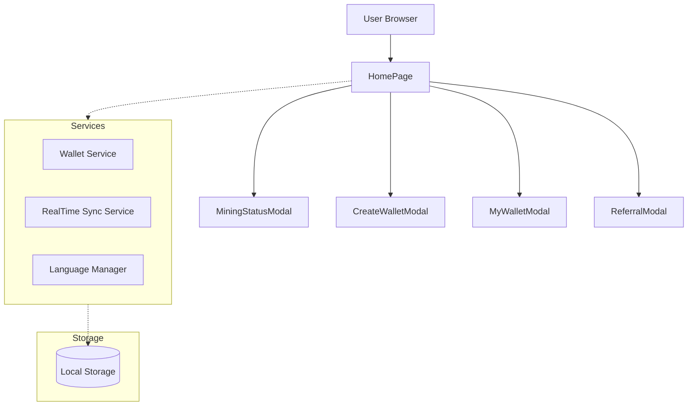

# BitWishNetwork Mining System - Technical Specification

## 1. System Overview (시스템 개요)

BitWishNetwork Mining System은 사용자가 웹 브라우저를 통해 가상의 BW 토큰을 채굴하고, 지갑을 생성/관리하며, 다양한 보너스 활동(출석, 추천 등)에 참여할 수 있는 **웹 기반 마이닝 플랫폼**입니다.
본 시스템은 **철저한 컴포넌트 독립성**, **전역 상태 배제**, **강력한 보안 규칙**을 준수하여 설계되었습니다.

### 1.1 Core Design Principles (핵심 설계 원칙)
1.  **Zero Global State:** Redux, Context API 등 전역 상태 관리 라이브러리를 사용하지 않으며, 각 컴포넌트는 독립적인 상태를 가집니다.
2.  **Component Isolation:** 모든 컴포넌트는 자체적으로 필요한 데이터를 로드하고 관리하며, 부모-자식 간의 의존성을 최소화합니다.
3.  **Security First:** 지갑 생성 및 관리는 클라이언트 측에서 안전하게 처리되며, 민감한 정보(Mnemonic, Private Key)는 암호화되어 로컬 스토리지에 저장됩니다.
4.  **Real-Time Sync:** 마이닝 상태, 블록체인 데이터 등은 실시간으로 동기화되어 사용자에게 최신 정보를 제공합니다.

---

## 2. System Architecture (시스템 아키텍처)

### 2.1 High-Level Architecture


### 2.2 Data Flow (데이터 흐름)
*   **Initialization:** 앱 실행 시 `HomePage`가 로드되며, `LanguageManager`를 통해 언어 설정을, `RealTimeSyncService`를 통해 마이닝 상태를 초기화합니다.
*   **Wallet Management:** `CreateWalletModal`을 통해 지갑을 생성하면 `WalletService`가 Mnemonic을 생성/암호화하여 `localStorage`에 저장합니다.
*   **Mining Process:** `MiningStatusModal`은 독립적으로 마이닝 타이머를 가동하며, 보상 계산 로직을 수행합니다.
*   **Bonus System:** 출석, 추천 등의 보너스는 각각의 모달(`AttendanceModal`, `ReferralModal`)에서 독립적으로 처리되고 저장됩니다.

---

## 3. Directory & File Structure (디렉토리 및 파일 구조)

`src/`
├── **components/** (UI 컴포넌트)
│   ├── **HomePage/**: 메인 진입점. 전체 레이아웃 및 모달 제어.
│   ├── **MiningStatusModal/**: 마이닝 현황판. 실시간 채굴량 및 보너스 표시.
│   ├── **CreateWalletModal/**: 지갑 생성 프로세스 (시드 구문 생성/확인).
│   ├── **MyWalletModal/**: 내 지갑 정보 확인 및 송금 기능.
│   ├── **WalletAuthModal/**: 지갑 접근을 위한 시드 구문 인증.
│   ├── **MiningAuthModal/**: 마이닝 시작 전 2차 비밀번호 인증.
│   ├── **SecondPasswordModal/**: 2차 비밀번호 설정.
│   ├── **ReferralModal/**: 추천인 코드 생성 및 공유.
│   └── **AttendanceModal/**: 매일 출석 체크 및 보너스 지급.
│
├── **services/** (비즈니스 로직)
│   ├── **WalletService/**: 지갑 생성, 암호화, 검증, 저장 관리. (Core)
│   ├── **MiningService/**: 실시간 마이닝 데이터 동기화.
│   └── **BlockchainService/**: (Future) 실제 블록체인 노드 통신.
│
├── **utils/** (유틸리티)
│   ├── **LanguageManager/**: 다국어(KO, EN, JA, ZH) 지원 시스템.
│   └── **PrecisionCalculator/**: `decimal.js` 기반 고정밀 연산 처리.
│
└── **types/**: TypeScript 인터페이스 및 타입 정의 (`index.ts`).

---

## 4. Core Modules Specification (핵심 모듈 명세)

### 4.1 WalletService (`src/services/WalletService/WalletService.ts`)
*   **Role:** 지갑의 생성, 저장, 불러오기, 보안 인증을 전담하는 핵심 서비스.
*   **Key Methods:**
    *   `createWallet(mnemonic, password)`: 시드 구문으로 지갑 생성 및 암호화 저장.
    *   `getStoredWallet()`: 로컬 스토리지에서 지갑 데이터 로드.
    *   `validateMnemonic(mnemonic)`: BIP39 표준 시드 구문 유효성 검사.
    *   `setSecondPassword(address, password)`: 2차 비밀번호 설정 (PBKDF2 해싱).
    *   `verifySecondPassword(address, password)`: 2차 비밀번호 검증.
*   **Security:**
    *   Mnemonic은 Base64 인코딩(데모) 또는 AES 암호화(프로덕션)되어 저장.
    *   2차 비밀번호는 Salt와 함께 PBKDF2로 해싱되어 저장.

### 4.2 RealTimeSyncService (`src/services/MiningService/RealTimeSyncService.ts`)
*   **Role:** 마이닝 관련 수치(총 발행량, 채굴량 등)를 실시간으로 시뮬레이션하고 동기화.
*   **Key Methods:**
    *   `startSync(callback)`: 1초 단위로 데이터를 갱신하며 콜백 호출.
    *   `getCurrentStatus()`: 현재 시점의 마이닝 상태 반환.

### 4.3 HomePage (`src/components/HomePage/HomePage.tsx`)
*   **Role:** 애플리케이션의 메인 허브.
*   **Features:**
    *   네비게이션 및 헤더 컨트롤 (언어, 테마, 지갑).
    *   실시간 블록체인 상태 대시보드 (총 발행량, 블록 수 등).
    *   모든 모달(`MiningStatusModal`, `CreateWalletModal` 등)의 표시 여부(`isOpen`) 관리.
    *   **독립성 보장:** 자식 컴포넌트에 불필요한 Props를 넘기지 않고, 각 모달이 스스로 데이터를 로드하도록 설계.

---

## 5. Data Schema & Storage (데이터 스키마 및 저장소)

### 5.1 Local Storage Keys
*   `bw_wallet_data`: 지갑 핵심 데이터 (주소, 암호화된 시드, 2차 비번 등).
*   `bw_mining_status`: 마이닝 진행 상태 (시작 시간, 누적 채굴량).
*   `bw_attendance_data`: 출석 체크 기록 (날짜 배열).
*   `bw-theme`: 테마 설정 (light/dark).
*   `bw-lang`: 언어 설정.

### 5.2 Wallet Data Structure (`WalletData`)
```typescript
interface WalletData {
    address: string;          // BW... (42 chars)
    publicKey: string;
    encryptedMnemonic: string; // Encrypted Seed Phrase
    createdAt: number;
    balance: number;
    availableBalance: number;
    referralReward: number;
    referralBonus: number;
    myReferralCode: string;   // Unique Referral Code
    secondPassword?: string;  // salt:hash
}
```

---

## 6. Security & Scalability (보안 및 확장성)

### 6.1 Security Measures
*   **Client-Side Key Management:** 개인키와 시드 구문은 절대 서버로 전송되지 않으며, 브라우저 내부에만 저장됩니다.
*   **Second Password:** 마이닝 시작 및 중요 트랜잭션 실행 시 2차 비밀번호를 요구하여 보안을 강화했습니다.
*   **Address Validation:** 모든 주소 입력 필드는 `BW`로 시작하는 42자리 형식을 엄격히 검증합니다.

### 6.2 Future Scalability
*   **Blockchain Integration:** 현재의 `RealTimeSyncService`를 실제 블록체인 노드 API(`Web3.js` or `Ethers.js` equivalent)로 교체하면 즉시 메인넷과 연동 가능합니다.
*   **KYC System:** `User` 인터페이스에 이미 `kycStatus` 필드가 정의되어 있어, 추후 KYC 인증 모듈을 쉽게 통합할 수 있습니다.

---

**Document Version:** 1.0.0
**Last Updated:** 2025-11-24
**Author:** BitWishNetwork Dev Team (Antigravity)
