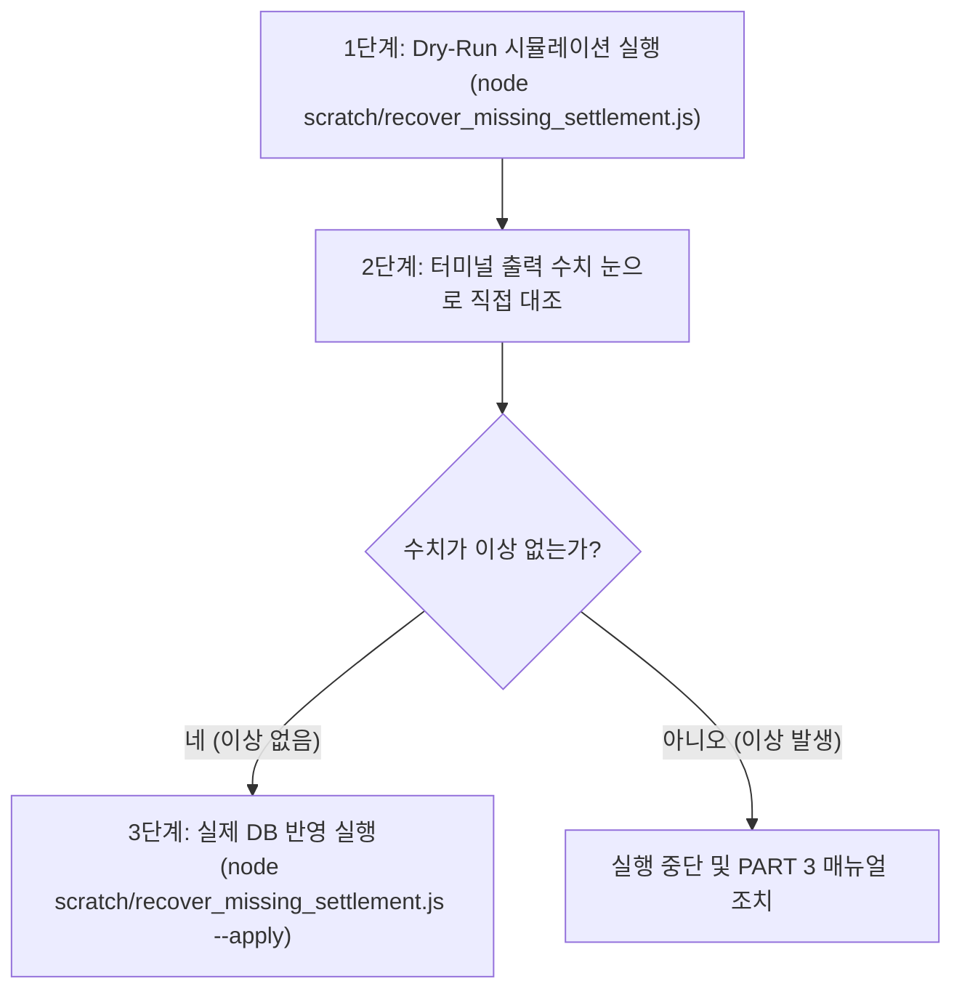

# [BitWish Network] 비개발자·초보자 전용 실서버 배포 및 비상 대처 초정밀 지침서

---

## 🛡️ PART 1. 배포 전 10초 사전 예방 조치 (필수 준비)

깃허브에 작업 완료한 코드를 모두 푸시 한 후 실서버 배포나 소급 복원 스크립트를 실행하기 **단 1초 전**, Vultr서버 터미널에 아래 2가지 명령어를 복사해서 붙여넣으십시오. 이 2가지가 완벽한 안전용 튜브 역할을 합니다.

### 1) DB 스냅샷 백업 (데이터 안전용)
```bash
mongodump --out /backup/pre_settlement_fix

> **설명**: 현재 실제 회원들의 모든 지갑 데이터와 채굴 수치를 `/backup/pre_settlement_fix` 폴더에 그대로 복사해 둡니다.


=====


### 2) Git 백업 커밋 태그 생성 (코드 안전용)
```bash
git tag prod-backup-pre-settlement

> **설명**: 현재 정상 작동 중인 소스코드 버전에 `prod-backup-pre-settlement`라는 이름표를 달아둡니다.


=============================================================================================


## 🧪 PART 2. 안전 배포 및 복원 스크립트 실행 3단계 (Safety Deployment)

운영 서버에 코드를 올린 후 과거 6월, 7월 누락 정산을 적용할 때 아래 3단계를 순서대로 진행합니다.



### 1단계: 시뮬레이션(Dry-Run) 1회 실행
```bash
node scratch/recover_missing_settlement.js
```
- **특징**: DB를 단 1바이트도 수정하지 않습니다.
- **결과**: 화면에 `지갑: BW71C455... | 2026년 6월: 50 BW | 2026년 7월: 249 BW`처럼 실운영 유저들의 복원 예정 수량이 프린트됩니다.

### 2단계: 화면 로그 눈으로 대조 검증
- 터미널에 나온 회원별 6월, 7월 채굴 수치가 합리적인지 눈으로 확인합니다.

### 3단계: 실제 DB 반영 실행
로그에 이상이 없음을 확인한 후, 아래 명령어로 실제 운영 DB에 적용합니다.
```bash
node scratch/recover_missing_settlement.js --apply
```

=============================================================================================

## 🚨 PART 3. 문제 발생 시 눈으로 판별하는 3가지 증상과 대처법 (비상 조치)

배포 후 이상 현상이 발견되면, 비개발자라도 **눈으로 보는 증상**에 따라 즉시 아래 명령어를 복사해서 터미널에 붙여넣으시면 100% 원상복구됩니다.

### 🔍 증상 1. 웹사이트와 지갑 창은 잘 열리는데 숫자가 이상할 때
- **원인**: 백엔드 코드는 정상이지만 데이터베이스(DB) 수치에 이상이 생긴 경우.
- **대처 명령어 (복사해서 붙여넣기)**:
```bash
mongorestore --drop /backup/pre_settlement_fix
```
- **결과**: 10초 만에 배포 직전의 원래 DB 데이터로 100% 원상복구됩니다.

---

### 🔍 증상 2. 지갑 버튼이 안 눌리거나 웹 화면에 500/404 에러창이 뜰 때
- **원인**: 백엔드 소스코드나 프론트엔드 빌드 실행 중 코드가 멈춘 경우.
- **대처 명령어 (복사해서 붙여넣기)**:
```bash
git checkout prod-backup-pre-settlement
npm run build
pm2 restart all
```
- **결과**: 어제/오늘 고친 코드가 적용되기 전, 100% 잘 작동하던 옛날 소스코드 및 웹 화면으로 1초 만에 완전히 되돌아갑니다.

---

### 🔍 증상 3. 도무지 무슨 상황인지 모르겠거나 빨간 글씨가 터질 때
- **원인**: 1번인지 2번인지 헷갈리거나 시스템 예외가 발생한 경우.
- **대처 방법**:
  1. 서버 터미널에 아래 명령어를 입력합니다.
```bash
pm2 logs --lines 50
```
  2. 터미널 화면에 뜨는 빨간색 에러 글자를 그대로 복사해서 **AI(나)에게 전송**합니다.
  3. AI가 1초 만에 에러 줄 번호와 원인을 분석하여 정확한 정정 조치를 즉시 완료해 드립니다.

---

## ❓ PART 4. 자주 묻는 질문 (FAQ)

### Q1. 롤백(되돌리기)을 하면 실시간 채굴 중인 회원 데이터가 날아가나요?
> **답변**: 사전 백업해둔 `/backup/pre_settlement_fix`로 복원되므로 배포 전까지 회원들이 캔 수량과 가입 정보는 단 0.00000001 BW도 날아가지 않고 안전하게 보존됩니다.

### Q2. 비개발자인 제가 명령어를 잘못 칠까 봐 무서운데 어떻게 하죠?
> **답변**: 위 지침서에 적힌 영어 명령어는 알파벳 한 글자 틀리지 않게 작성해 둔 코드입니다. **단순히 마우스로 긁어서 터미널 창에 우클릭(붙여넣기) 후 엔터(Enter)**만 누르시면 시스템이 알아서 안전하게 작동합니다.
